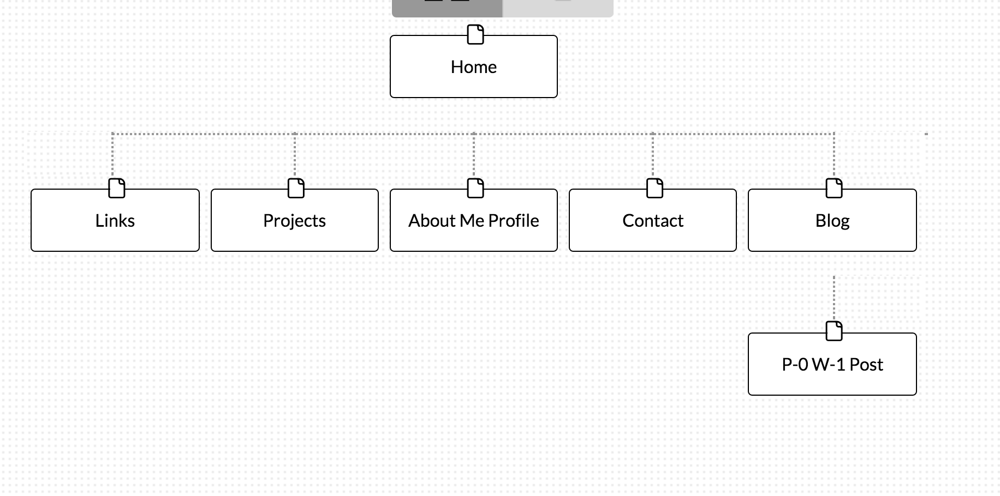

Here is my sitemap:

### What are the 6 Phases of Web Design?
  The six phases are:
   Information Gathering - keeping in mind the purpose, goals, target audience, and content
   Planning - creating a sitemap, and deciding what technologies or content management system to use
   Design - thinking about the color schemes, logo usages, etc, with the target audience in mind
   Development - developing the home page first, then a shell of other pages, and then filling out the rest
   Testing and Delivery - testing all of the pages, testing the usability on different devices and browsers, testing all the scripts, testing the validation of all code, installing necessary plugins, and search engine optimization
   Maintenance - maintaining and updating the site
### What is your site's primary goal or purpose? What kind of content will your site feature?
  My site is about broadcasting myself and my work publicly to increase my online dev footprint.
### What is your target audience's interests and how do you see your site addressing them?
  My target audience will be potential employers as well as friends and family who are interesting in seeing what I am doing. Therefore, my site will be somewhat professional but certainly not stiff, and I will also want to display my creativity.
### What is the primary "action" the user should take when coming to your site? Do you want them to search for information, contact you, or see your portfolio? It's ok to have several actions at once, or different actions for different kinds of visitors.
  I want them to see my portfolio, and I want them to be able to reach me through contacting me and getting in touch with me on other websites such as linkedin.
### What are the main things someone should know about design and user experience?
  It seems like there is a ton of knowledge related to design and user experience, but I will try to pick the ones that seem most important to me. I think that accessibility and performance from different browsers and devices seems like a primary concern, and taking into account the amount of data and speed when coming from a mobile device, for example. That includes worrying about file sizes, fonts, image types, image compression, number of requests, etc. Certainly in the design phases, knowing the purpose of the site and the target audience is crucial, as is testing the usability. Back to UX, there are dozens of tools that can be used to analyze the user experience, get feedback, a/b test, and more, and as many as possible should be utilized to improve the experience.
### What is user experience design and why is it valuable?
  User experience design is the idea that the site is designed with the user experience in mind. Previously, sites were made based on what the developers liked and what they want to show the client. Now, sites are built based on the needs and wants of users. It is important that users find a site valuable, simple to use, and pleasant, so that they DO use it and keep using it. User experience as a whole includes all about how a user feels when using a system. That includes the performance, accessibility, usability, interaction, utility, and design.
### Which parts of the challenge did you find tedious?
  I did not find it tedious, because it made me think about things I had never thought about before, like picking the exact right type of colors or fonts, but also primarily it made me wonder about all the different compatibility required by different browsers and devices, which I found fascinating. I do think that the Design stuff video could have been about 4-5 minutes shorter purely by editing out the troubleshooting that took place.
