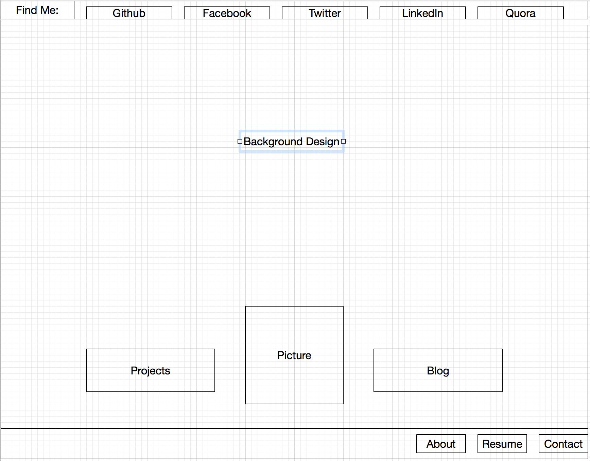
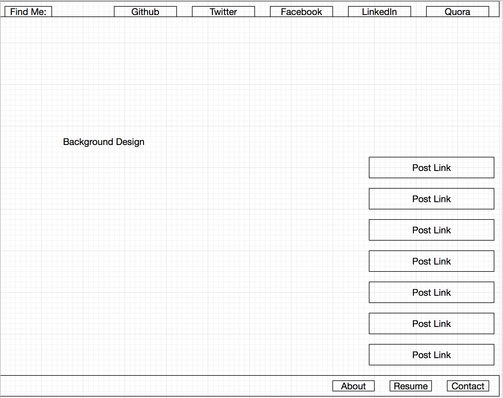

##### Index Wireframe

##### Blog/Index Wireframe

#### What is a wireframe?
  A wireframe is a skeleton sheet or outline sketch that displays a rough layout of shapes for the design of a potential website or project. It is a simplistic design, typically only using black and white simple shapes, and uses basic topography only as a placeholder for shape labels. It does not show any content originally, until the hi-definition wireframe.
What are the benefits of wireframing?
  It helps provide a skeleton of the direction that the design of the site will follow, before going too far into the design scheme and later the development. It makes it easier to visualize what is happening on the page before getting too far into the work, rather than picking colors/images/logos separately and then imagining what it will look like staring at the code.
Did you enjoy wireframing your site?
  No. I was very frustrated. I spent too long trying to figure out how my site was going to even be cool because I cannot even imagine the content I will be producing at this point. Specifically, I think once I know what all the projects I will be working on are, I will be able to make some projects display more prominently on the site index, rather than just have links to *Blogs* and a generic *Projects*.
Did you revise your wireframe or stick with your first idea?
  I revised a few different times, moving boxes all over the place.
What questions did you ask during this challenge? What resources did you find to help you answer them?
  I was trying to find good wireframing sites that give free trials; I ended up using OmniGraffle for this wireframe, and I saved by screenshotting because the trial version requires a proprietary file extension. I think I need to play around with a few other wireframming apps so that I can get more comfortable and also try out new features.
Which parts of the challenge did you enjoy and which parts did you find tedious?
  I enjoyed getting my feet wet wireframing; I was merely frustrated not being confident in how my site will look. I did not want to look at too many wireframe examples because I was kind of hoping I would be able to magically create a great wireframe on my own.
