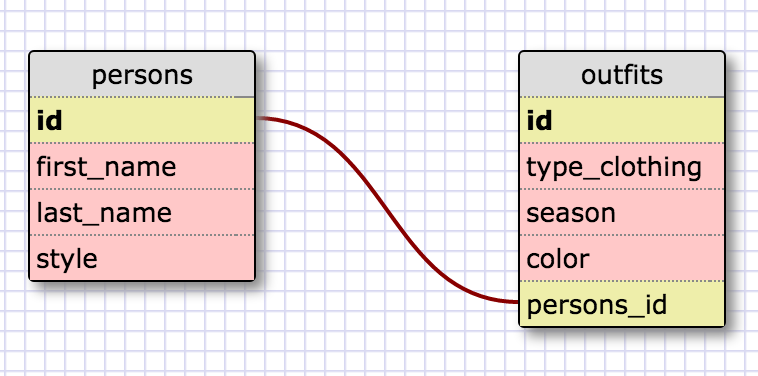

8.4 Intro to SQL

Queries:
1.
SELECT * FROM states; 
2.
SELECT * FROM regions; 
3.
SELECT state_name, population FROM states; 
4.
SELECT state_name, population FROM states ORDER BY population DESC; 
5.
SELECT state_name FROM states WHERE region_id = 7; 
6.
SELECT state_name, population_density FROM states WHERE population_density > 50 ORDER BY population_density ASC; 
7.
SELECT state_name FROM states WHERE population BETWEEN 1000000 AND 1500000; 
8.
SELECT state_name, region_id FROM states ORDER BY region_id ASC; 
9.
SELECT region_name FROM regions WHERE region_name LIKE '%central%'; 
10.
SELECT regions.region_name, states.state_name FROM regions INNER JOIN states ON regions.id = states.region_id; 

What are databases for? 
Storing large amounts of data, larger than the useful scope of an object or hash. The data are stored in rows 
 and can have any number of attributes per record. No records ought to be duplicated.

What is a one-to-many relationship? 
Where a first object belongs inside the category of a second object, but the second object can encompass 
 multiple first objects.

What is a primary key? What is a foreign key? How can you determine which is which? 
All tables will have a primary key that has a uniqueness within that table and it always has 
 a non-blank value.
The primary key can uniquely identify a record/row in a database. 
A foreign key is a column (or columns) that identify a row of another table. It typically refers 
 to the primary key in another table, and it is a general requirement that the foreign key values equal the other table's primary key values that 
  they correspond to. A table with a foreign key still has its own primary key. 
You can actually call SQL commands to discover foreign keys and dependencies, but eyeball ways 
to see the difference are that the primary keys are always unique, where the foreign ones don't 
have to be, and ideally the foreign keys will be appropriately titled to reference the employee_id, 
region_id, etc, from the other table.

How can you select information out of a SQL database? What are some general guidelines for that? 
To get information from a database you will be using SELECT. You can select specific columns 
separated by commas or *, all the columns. You will specify FROM which table you want your 
data. You may choose to GROUP BY or ORDER BY certain columns, and you may also filter WHERE certain conditions are met. 
You may also LIMIT how many records you get back or only select DISTINCT values from a particular column. 
And other stuff I have not learned yet.
