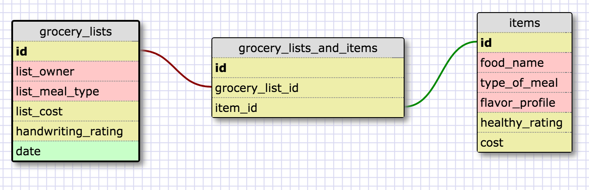

The above is a one-to-one example. Each table contains information about employees - one employee in the first table can only have one employee record of information in the second table. The reason that two tables are useful here is because the first table has common information that may be queried frequently and all fields will be filled in for every employee. The second table has sensitive information, like the employee ssn, salary, secret_crush, and weakness_to_exploit, and it also contains many optional fields which might be left blank for some employees.

By splitting up these two tables, a company can (1) restrict access to the sensitive table (which is easier than restricting access to specific columns like an ssn column) and (2) make common lookups in the first table faster, because there won't be many optionally empty or irrelevant fields for 95% of the queries that admins will be performing.

The above is a many-to-many database schema.

Reflection

What is a one-to-one database? 
A one to one database is a set of two tables where a record in one table corresponds to only one record in the other table and vice-versa. 

When would you use a one-to-one database? (Think generally, not in terms of the example you created). 
One reason is for security - if a table has a lot of sensitive information, you can restrict access easier by splitting off the sensitive information into another table, rather than trying to restrict access to specific columns. Another reason is for faster lookups. If one table has hundreds of attributes that are either empty (because they are optional) or irrelevant to 95% of the queries needed, it would be better to split off all of the optional, mostly empty, or irrelevant data so that the the majority of common lookups could be queried faster in the original table. Finally, it may also make sense to store certain data on certain servers that may be relevant to certain parts of a company. 

What is a many-to-many database? 
A many-to-many database is a set of tables where a common table can group together multiple records from the first table with multiple records from the second table. For example in a table of ids [A, B, C, D] and another table of [1, 2, 3, 4], a join table may have [A1, A2, A3, B1, B3, B4, C2 etc].

When would you use a many-to-many database? (Think generally, not in terms of the example you created). 
A many-to-many database can be useful anytime you have two sets of records where records in each table may be grouped with more than one record in another table.

What is confusing about database schemas? What makes sense? 
Most of it makes sense. I think looking at complex databases with many relationships would start to get more confusing. Also, the brief information I read about many-to-many relationships is to avoid them - that it would be better to have multiple one-to-many relationships than a single many-to-many one.